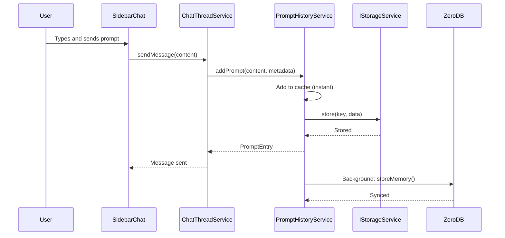
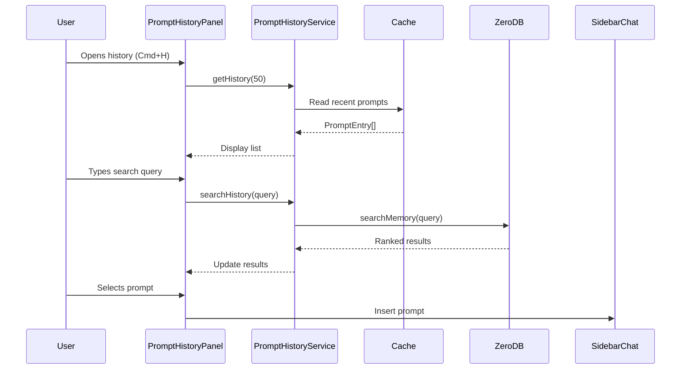

# Prompt History Feature - Architecture Document

**Issue**: #29 - Add user prompt history feature
**Date**: January 2, 2026
**Status**: Design Phase
**Estimated Effort**: 3-4 days

---

## 1. Executive Summary

### Overview
Implement a comprehensive prompt history feature that allows users to view, search, navigate, and reuse prompts from both current and previous sessions. The feature integrates local storage for fast access with ZeroDB vector search for semantic discovery.

### Key Decisions
1. **Hybrid Storage Strategy**: IStorageService for persistence + ZeroDB for semantic search + in-memory cache for performance
2. **Service Architecture**: New `PromptHistoryService` registered as singleton with dependency injection
3. **UI Component**: React-based `PromptHistoryPanel` integrated into sidebar
4. **Keyboard Shortcuts**: `Cmd/Ctrl+H` for history, `Up/Down` for navigation
5. **Vector Search**: ZeroDB Memory API for semantic search across prompts
6. **Privacy First**: User-controlled history with clear/delete capabilities

### Success Metrics
- Prompt storage latency < 100ms (local) + background sync to ZeroDB
- Search results returned in < 500ms
- 100% prompt capture rate for user messages
- Zero data loss on IDE restart
- 80%+ test coverage

---

## 2. Requirements Analysis

### Functional Requirements

#### FR-1: Prompt Storage
- **FR-1.1**: Capture all user prompts sent to the AI
- **FR-1.2**: Store prompt metadata (timestamp, thread ID, model, provider)
- **FR-1.3**: Persist prompts across IDE sessions
- **FR-1.4**: Support manual prompt deletion

#### FR-2: History Navigation
- **FR-2.1**: Display chronological list of prompts
- **FR-2.2**: Navigate using keyboard (Up/Down arrows)
- **FR-2.3**: Navigate using mouse/touch
- **FR-2.4**: Show prompt preview in list view

#### FR-3: Search Functionality
- **FR-3.1**: Semantic search using ZeroDB vectors
- **FR-3.2**: Full-text search fallback
- **FR-3.3**: Filter by date range
- **FR-3.4**: Filter by model/provider

#### FR-4: Prompt Reuse
- **FR-4.1**: Click to insert prompt into chat input
- **FR-4.2**: Edit before sending
- **FR-4.3**: Copy prompt to clipboard

#### FR-5: Privacy Controls
- **FR-5.1**: Clear entire history
- **FR-5.2**: Clear history older than N days
- **FR-5.3**: Opt-out of ZeroDB sync (local only)
- **FR-5.4**: Export history as JSON

### Non-Functional Requirements

#### NFR-1: Performance
- Prompt storage: < 100ms (blocking) + background ZeroDB sync
- History load: < 200ms for 1000 entries
- Search: < 500ms for semantic search
- UI responsiveness: 60 FPS scrolling

#### NFR-2: Scalability
- Support 10,000+ prompts per user
- Pagination for large result sets
- Efficient memory usage (< 50MB for 1000 prompts)

#### NFR-3: Reliability
- 100% prompt capture rate
- Graceful degradation if ZeroDB unavailable
- Automatic retry for failed syncs
- Data integrity validation

#### NFR-4: Security
- No PII exposure in logs
- Secure storage (encrypted at rest via VS Code storage)
- API tokens never stored in prompts
- User consent for cloud sync

#### NFR-5: Maintainability
- 80%+ unit test coverage
- Integration tests for ZeroDB
- E2E tests for critical paths
- TypeScript strict mode compliance

---

## 3. Proposed Architecture

### 3.1 System Overview

```
┌─────────────────────────────────────────────────────────────┐
│                        User Interface                        │
├─────────────────────────────────────────────────────────────┤
│  PromptHistoryPanel (React)                                 │
│  - List View (chronological)                                │
│  - Search Bar (text + filters)                              │
│  - Prompt Preview                                           │
│  - Keyboard Navigation (Cmd+H, Up/Down, Enter, Esc)        │
└─────────────────────────────────────────────────────────────┘
                            ↕
┌─────────────────────────────────────────────────────────────┐
│                    Service Layer                             │
├─────────────────────────────────────────────────────────────┤
│  IPromptHistoryService (Singleton)                          │
│  - addPrompt(content, metadata)                             │
│  - getHistory(limit?, offset?)                              │
│  - searchHistory(query, filters?)                           │
│  - clearHistory(options?)                                   │
│  - deletePrompt(id)                                         │
│  - exportHistory()                                          │
└─────────────────────────────────────────────────────────────┘
                            ↕
┌─────────────────────────────────────────────────────────────┐
│                    Storage Layer (Triple Strategy)           │
├─────────────────────────────────────────────────────────────┤
│  1. In-Memory Cache                                         │
│     - LRU cache (100 most recent prompts)                   │
│     - Fast access for UI                                    │
│                                                             │
│  2. IStorageService (Local Persistence)                     │
│     - StorageScope.APPLICATION                              │
│     - StorageTarget.USER                                    │
│     - Key: ainative.promptHistory                           │
│     - Synchronous writes                                    │
│                                                             │
│  3. ZeroDB Memory API (Semantic Search)                     │
│     - Async background sync                                 │
│     - Vector embeddings for semantic search                 │
│     - Retry queue for failed syncs                          │
└─────────────────────────────────────────────────────────────┘
                            ↕
┌─────────────────────────────────────────────────────────────┐
│                    Integration Points                        │
├─────────────────────────────────────────────────────────────┤
│  ChatThreadService                                          │
│  - Hook into sendMessage()                                  │
│  - Extract user prompts                                     │
│  - Call promptHistoryService.addPrompt()                    │
└─────────────────────────────────────────────────────────────┘
```

### 3.2 Data Flow Diagram

```
User Types Prompt
       ↓
SidebarChat.tsx (onSubmit)
       ↓
chatThreadService.sendMessage()
       ↓
[1] promptHistoryService.addPrompt()
       ↓
[2] Write to In-Memory Cache (instant)
       ↓
[3] Write to IStorageService (< 100ms, blocking)
       ↓
[4] Background: Sync to ZeroDB Memory API
       ↓
[5] ZeroDB generates vector embedding
       ↓
[6] Store in ZeroDB with metadata
```

**Search Flow**:
```
User Opens History (Cmd+H)
       ↓
PromptHistoryPanel mounts
       ↓
promptHistoryService.getHistory(50)
       ↓
Read from In-Memory Cache
       ↓
Render List View
       ↓
User Types Search Query
       ↓
promptHistoryService.searchHistory(query)
       ↓
[If local search] Filter in-memory cache
[If semantic search] Query ZeroDB vectors
       ↓
Return ranked results
       ↓
Update UI with results
```

### 3.3 Component Architecture

#### Backend Services

**File**: `/ainative-studio/src/vs/workbench/contrib/ainative/common/promptHistoryService.ts`

```typescript
import { createDecorator } from '../../../../platform/instantiation/common/instantiation.js';
import { registerSingleton, InstantiationType } from '../../../../platform/instantiation/common/extensions.js';
import { Disposable } from '../../../../base/common/lifecycle.js';
import { Emitter, Event } from '../../../../base/common/event.js';
import { IStorageService, StorageScope, StorageTarget } from '../../../../platform/storage/common/storage.js';
import { IAgentMemoryService } from './agentMemoryService.js';
import { IAINativeAuthService } from './ainativeAuthService.js';
import { generateUuid } from '../../../../base/common/uuid.js';
import { PROMPT_HISTORY_STORAGE_KEY } from './storageKeys.js';

export const IPromptHistoryService = createDecorator<IPromptHistoryService>('promptHistoryService');

/**
 * Metadata associated with a prompt
 */
export interface PromptMetadata {
	readonly threadId?: string;
	readonly modelName?: string;
	readonly providerName?: string;
	readonly tags?: string[];
	readonly contextFiles?: string[];
}

/**
 * A stored prompt entry
 */
export interface PromptEntry {
	readonly id: string;
	readonly content: string;
	readonly timestamp: number;
	readonly metadata: PromptMetadata;
}

/**
 * Search filters for prompt history
 */
export interface PromptSearchFilters {
	readonly dateRange?: { start: number; end: number };
	readonly providerName?: string;
	readonly modelName?: string;
	readonly threadId?: string;
}

/**
 * Options for clearing history
 */
export interface ClearHistoryOptions {
	readonly olderThan?: number; // timestamp
	readonly threadId?: string;
	readonly confirm?: boolean;
}

/**
 * Prompt History Service Interface
 */
export interface IPromptHistoryService {
	readonly _serviceBrand: undefined;

	/**
	 * Event fired when a prompt is added
	 */
	readonly onDidAddPrompt: Event<PromptEntry>;

	/**
	 * Event fired when history is cleared
	 */
	readonly onDidClearHistory: Event<void>;

	/**
	 * Add a prompt to history
	 */
	addPrompt(content: string, metadata: PromptMetadata): Promise<PromptEntry>;

	/**
	 * Get prompt history (paginated)
	 */
	getHistory(limit?: number, offset?: number): Promise<PromptEntry[]>;

	/**
	 * Search prompts semantically or by text
	 */
	searchHistory(query: string, filters?: PromptSearchFilters): Promise<PromptEntry[]>;

	/**
	 * Delete a specific prompt
	 */
	deletePrompt(id: string): Promise<void>;

	/**
	 * Clear history with options
	 */
	clearHistory(options?: ClearHistoryOptions): Promise<void>;

	/**
	 * Export history as JSON
	 */
	exportHistory(): Promise<string>;

	/**
	 * Get total prompt count
	 */
	getCount(): Promise<number>;
}
```

**Implementation Strategy**:

```typescript
export class PromptHistoryService extends Disposable implements IPromptHistoryService {
	readonly _serviceBrand: undefined;

	// In-memory cache (LRU, max 100 entries)
	private _cache: Map<string, PromptEntry> = new Map();
	private readonly _maxCacheSize = 100;

	// Sync queue for ZeroDB
	private _syncQueue: PromptEntry[] = [];
	private _isSyncing = false;

	// Events
	private readonly _onDidAddPrompt = this._register(new Emitter<PromptEntry>());
	readonly onDidAddPrompt = this._onDidAddPrompt.event;

	private readonly _onDidClearHistory = this._register(new Emitter<void>());
	readonly onDidClearHistory = this._onDidClearHistory.event;

	constructor(
		@IStorageService private readonly _storageService: IStorageService,
		@IAgentMemoryService private readonly _memoryService: IAgentMemoryService,
		@IAINativeAuthService private readonly _authService: IAINativeAuthService
	) {
		super();
		this._loadFromStorage();
		this._startBackgroundSync();
	}

	async addPrompt(content: string, metadata: PromptMetadata): Promise<PromptEntry> {
		const entry: PromptEntry = {
			id: generateUuid(),
			content,
			timestamp: Date.now(),
			metadata
		};

		// 1. Add to cache
		this._addToCache(entry);

		// 2. Persist to IStorageService (synchronous)
		this._saveToStorage();

		// 3. Queue for ZeroDB sync (async)
		this._queueForSync(entry);

		// 4. Emit event
		this._onDidAddPrompt.fire(entry);

		return entry;
	}

	// ... implementation details
}

registerSingleton(IPromptHistoryService, PromptHistoryService, InstantiationType.Eager);
```

#### Frontend UI Component

**File**: `/ainative-studio/src/vs/workbench/contrib/ainative/browser/react/src/sidebar-tsx/PromptHistoryPanel.tsx`

```typescript
import React, { useState, useEffect, useCallback, useRef } from 'react';
import { useAccessor } from '../util/services.js';
import { IPromptHistoryService, PromptEntry } from '../../../../common/promptHistoryService.js';
import { IconX, IconLoading } from './SidebarChat.js';

interface PromptHistoryPanelProps {
	onSelectPrompt: (content: string) => void;
	onClose: () => void;
}

export const PromptHistoryPanel: React.FC<PromptHistoryPanelProps> = ({
	onSelectPrompt,
	onClose
}) => {
	const accessor = useAccessor();
	const promptHistoryService = accessor.get(IPromptHistoryService);

	const [prompts, setPrompts] = useState<PromptEntry[]>([]);
	const [isLoading, setIsLoading] = useState(true);
	const [searchQuery, setSearchQuery] = useState('');
	const [selectedIndex, setSelectedIndex] = useState(0);

	// Load initial history
	useEffect(() => {
		loadHistory();
	}, []);

	const loadHistory = async () => {
		setIsLoading(true);
		try {
			const history = await promptHistoryService.getHistory(100);
			setPrompts(history);
		} finally {
			setIsLoading(false);
		}
	};

	// Search handler with debounce
	useEffect(() => {
		if (!searchQuery) {
			loadHistory();
			return;
		}

		const timer = setTimeout(async () => {
			setIsLoading(true);
			try {
				const results = await promptHistoryService.searchHistory(searchQuery);
				setPrompts(results);
			} finally {
				setIsLoading(false);
			}
		}, 300);

		return () => clearTimeout(timer);
	}, [searchQuery]);

	// Keyboard navigation
	const handleKeyDown = useCallback((e: React.KeyboardEvent) => {
		if (e.key === 'ArrowUp') {
			e.preventDefault();
			setSelectedIndex(i => Math.max(0, i - 1));
		} else if (e.key === 'ArrowDown') {
			e.preventDefault();
			setSelectedIndex(i => Math.min(prompts.length - 1, i + 1));
		} else if (e.key === 'Enter' && prompts[selectedIndex]) {
			e.preventDefault();
			onSelectPrompt(prompts[selectedIndex].content);
			onClose();
		} else if (e.key === 'Escape') {
			e.preventDefault();
			onClose();
		}
	}, [prompts, selectedIndex, onSelectPrompt, onClose]);

	// ... render implementation
};
```

#### Integration with ChatThreadService

**File**: `/ainative-studio/src/vs/workbench/contrib/ainative/browser/chatThreadService.ts`

```typescript
// Add to ChatThreadService class

@IPromptHistoryService private readonly _promptHistoryService: IPromptHistoryService

// In sendMessage() method, after creating user message:
private async sendMessage(options: SendMessageOptions): Promise<void> {
	// ... existing code to create user message ...

	// Capture prompt for history
	const userContent = this._extractUserContent(userMessage);
	if (userContent) {
		await this._promptHistoryService.addPrompt(userContent, {
			threadId: thread.id,
			modelName: modelSelection.modelName,
			providerName: modelSelection.providerName,
			contextFiles: this._getContextFileUris(userMessage)
		}).catch(err => {
			// Don't fail message send if history fails
			console.error('Failed to save prompt to history', err);
		});
	}

	// ... continue with existing message send logic ...
}
```

### 3.4 Keyboard Shortcuts

**File**: `/ainative-studio/src/vs/workbench/contrib/ainative/browser/promptHistoryActions.ts`

```typescript
import { KeyCode, KeyMod } from '../../../../base/common/keyCodes.js';
import { Action2, registerAction2 } from '../../../../platform/actions/common/actions.js';
import { ServicesAccessor } from '../../../../editor/browser/editorExtensions.js';
import { KeybindingWeight } from '../../../../platform/keybinding/common/keybindingsRegistry.js';
import { localize2 } from '../../../../nls.js';

// Action ID
export const AINATIVE_OPEN_PROMPT_HISTORY_ACTION_ID = 'ainative.promptHistory.open';

// Register Cmd+H to open prompt history
registerAction2(class extends Action2 {
	constructor() {
		super({
			id: AINATIVE_OPEN_PROMPT_HISTORY_ACTION_ID,
			f1: true,
			title: localize2('ainativePromptHistory', 'AINative Studio: Open Prompt History'),
			keybinding: {
				primary: KeyMod.CtrlCmd | KeyCode.KeyH,
				weight: KeybindingWeight.WorkbenchContrib
			}
		});
	}
	async run(accessor: ServicesAccessor): Promise<void> {
		// Open prompt history panel in sidebar
		// Implementation will trigger React component mount
	}
});
```

**Keyboard Shortcuts Summary**:
- `Cmd/Ctrl+H`: Open prompt history panel
- `Up/Down`: Navigate through prompts
- `Enter`: Select and use prompt
- `Esc`: Close history panel
- `Cmd/Ctrl+K`: Clear search (when in search box)
- `Cmd/Ctrl+Delete`: Delete selected prompt (with confirmation)

### 3.5 Storage Strategy

#### Triple-Tier Storage Architecture

**Tier 1: In-Memory Cache (Hot Data)**
- **Purpose**: Ultra-fast access for recent prompts
- **Technology**: JavaScript Map with LRU eviction
- **Size Limit**: 100 most recent prompts (~50KB)
- **Eviction**: Least Recently Used
- **Persistence**: None (rebuilt on service init)

**Tier 2: IStorageService (Warm Data)**
- **Purpose**: Local persistence across sessions
- **Technology**: VS Code storage API (encrypted at rest)
- **Storage Key**: `ainative.promptHistory`
- **Scope**: `StorageScope.APPLICATION` (global across workspaces)
- **Target**: `StorageTarget.USER` (user-specific)
- **Size Limit**: ~10MB (10,000 prompts)
- **Format**: JSON array of `PromptEntry[]`

**Tier 3: ZeroDB Memory API (Cold Data + Search)**
- **Purpose**: Semantic search and unlimited history
- **Technology**: ZeroDB MCP Server (`/zerodb-memory-store`, `/zerodb-memory-search`)
- **API Base**: `https://api.ainative.studio/v1`
- **Authentication**: `IAINativeAuthService` OAuth token
- **Size Limit**: Based on user's ZeroDB quota
- **Sync Strategy**: Background async with retry queue

#### Sync Flow

```
New Prompt
    ↓
[Tier 1] Cache.set() ← Instant (0-1ms)
    ↓
[Tier 2] Storage.store() ← Fast (10-100ms, blocking)
    ↓
Return to user (prompt sent)
    ↓
[Background Thread]
    ↓
[Tier 3] ZeroDB.sync() ← Slow (100-500ms, non-blocking)
    ↓
If failure → Add to retry queue
    ↓
Retry with exponential backoff
```

#### Data Schema

**Local Storage Format** (IStorageService):
```json
{
  "version": 1,
  "prompts": [
    {
      "id": "uuid-1234",
      "content": "How do I create a React component?",
      "timestamp": 1704196800000,
      "metadata": {
        "threadId": "thread-abc",
        "modelName": "claude-3-5-sonnet-20241022",
        "providerName": "Anthropic",
        "tags": ["react", "tutorial"],
        "contextFiles": ["file:///path/to/Component.tsx"]
      }
    }
  ],
  "lastSync": 1704196800000,
  "syncStatus": "synced"
}
```

**ZeroDB Memory Format**:
```json
{
  "content": "How do I create a React component?",
  "role": "user",
  "metadata": {
    "source": "ainative-ide-prompt-history",
    "timestamp": "2026-01-02T12:00:00Z",
    "sessionId": "thread-abc",
    "promptId": "uuid-1234",
    "modelName": "claude-3-5-sonnet-20241022",
    "providerName": "Anthropic",
    "tags": ["react", "tutorial"]
  }
}
```

### 3.6 Error Handling

#### Error Scenarios and Mitigation

| Scenario | Error Type | Mitigation Strategy | User Impact |
|----------|-----------|---------------------|-------------|
| ZeroDB unavailable | Network/Auth | Fallback to local storage only | Search limited to text match |
| Storage quota exceeded | QuotaExceededError | LRU eviction + user notification | Older prompts removed |
| Corrupted local storage | Parse error | Reset storage + restore from ZeroDB | Temporary data loss, then recovery |
| Sync failure | API error | Retry queue with exponential backoff | Transparent to user |
| Duplicate prompts | Logic error | Deduplication by content hash | Prevent bloat |
| Invalid prompt content | Validation error | Skip storage, log error | Graceful skip |

#### Fallback Behavior

**If ZeroDB is unavailable**:
1. Detect on service init (ping ZeroDB API)
2. Set `_zeroDbAvailable = false`
3. Show warning in UI: "Semantic search unavailable (offline mode)"
4. Continue with local-only storage
5. Retry ZeroDB connection every 5 minutes
6. Sync queued prompts when reconnected

**If local storage is corrupted**:
1. Catch parse error on init
2. Log error to console
3. Clear corrupted storage
4. Attempt restore from ZeroDB (if available)
5. Notify user: "Prompt history restored from cloud"

### 3.7 Privacy and Security

#### Privacy Controls

**Settings** (in `GlobalSettings`):
```typescript
interface GlobalSettings {
	// ... existing settings ...
	promptHistory: {
		enabled: boolean; // Default: true
		cloudSyncEnabled: boolean; // Default: true (requires auth)
		retentionDays: number; // Default: 90, 0 = unlimited
		maxPrompts: number; // Default: 10000
	}
}
```

**Clear History Options**:
1. **Clear All**: Delete all prompts (local + cloud)
2. **Clear Older Than**: Delete prompts older than N days
3. **Clear Thread**: Delete prompts from specific thread
4. **Export Before Clear**: Download JSON before deletion

#### Security Measures

1. **No PII Logging**: Never log prompt content to telemetry
2. **Encrypted Storage**: VS Code storage API encrypts at rest
3. **Secure API**: HTTPS + Bearer token for ZeroDB
4. **Content Sanitization**: Strip potential API keys/tokens before storage
5. **User Consent**: Require opt-in for cloud sync (default ON if authenticated)

---

## 4. Technology Stack

### Backend
- **Language**: TypeScript (strict mode)
- **DI Framework**: VS Code Instantiation API
- **Storage**: IStorageService (VS Code platform API)
- **Vector Search**: ZeroDB Memory API (MCP Server)
- **Authentication**: IAINativeAuthService (OAuth)
- **Events**: VS Code Event Emitter

### Frontend
- **Framework**: React 19.1.0
- **Build**: Node build.js (custom React bundler)
- **Styling**: Inline CSS-in-JS (existing pattern)
- **Icons**: Lucide React
- **State**: React hooks + VS Code service state

### External APIs
- **ZeroDB Memory Store**: `POST /v1/memory/store`
- **ZeroDB Memory Search**: `POST /v1/memory/search`
- **ZeroDB Context**: `GET /v1/memory/context`

---

## 5. Implementation Roadmap

### Phase 1: Backend Service (Day 1)
**Goal**: Functional service with local storage

- [ ] Create `promptHistoryService.ts` interface
- [ ] Implement `PromptHistoryService` class
- [ ] Add to `ainative.contribution.ts`
- [ ] Implement in-memory cache (LRU)
- [ ] Implement IStorageService persistence
- [ ] Write unit tests (target 80% coverage)
- [ ] Integration with `chatThreadService.ts`

**Deliverables**:
- `/ainative-studio/src/vs/workbench/contrib/ainative/common/promptHistoryService.ts`
- `/ainative-studio/src/vs/workbench/contrib/ainative/test/common/promptHistoryService.test.ts`
- Updated `chatThreadService.ts`
- Updated `ainative.contribution.ts`

### Phase 2: ZeroDB Integration (Day 2)
**Goal**: Cloud sync with semantic search

- [ ] Implement background sync queue
- [ ] Add retry logic with exponential backoff
- [ ] Implement `searchHistory()` with ZeroDB vectors
- [ ] Add fallback to local search if ZeroDB unavailable
- [ ] Write integration tests for ZeroDB
- [ ] Add telemetry for sync success/failure rates

**Deliverables**:
- ZeroDB sync implementation in `promptHistoryService.ts`
- Integration tests
- Telemetry events

### Phase 3: Frontend UI (Day 3)
**Goal**: Usable React component

- [ ] Create `PromptHistoryPanel.tsx`
- [ ] Implement list view with virtualization
- [ ] Add search bar with debounce
- [ ] Implement keyboard navigation
- [ ] Add loading states and error handling
- [ ] Style to match existing sidebar design
- [ ] Write React component tests

**Deliverables**:
- `/ainative-studio/src/vs/workbench/contrib/ainative/browser/react/src/sidebar-tsx/PromptHistoryPanel.tsx`
- Component tests

### Phase 4: Keyboard Shortcuts & Polish (Day 4)
**Goal**: Production-ready feature

- [ ] Create `promptHistoryActions.ts`
- [ ] Register `Cmd+H` keybinding
- [ ] Add action to command palette (F1)
- [ ] Implement clear history functionality
- [ ] Add export to JSON feature
- [ ] Add privacy settings UI
- [ ] Write E2E smoke tests
- [ ] Performance optimization
- [ ] Documentation

**Deliverables**:
- `/ainative-studio/src/vs/workbench/contrib/ainative/browser/promptHistoryActions.ts`
- E2E tests
- User documentation

---

## 6. Risk Assessment

### Technical Risks

| Risk | Probability | Impact | Mitigation |
|------|-------------|--------|------------|
| **Storage quota exceeded** | Medium | Medium | Implement LRU eviction + user notification |
| **ZeroDB API changes** | Low | High | Version API calls, maintain compatibility layer |
| **Performance degradation** | Medium | Medium | Pagination, virtualization, lazy loading |
| **Sync conflicts** | Low | Low | Timestamp-based conflict resolution |
| **Memory leaks** | Medium | Medium | Proper disposal in React effects, service cleanup |

### Product Risks

| Risk | Probability | Impact | Mitigation |
|------|-------------|--------|------------|
| **User privacy concerns** | Low | High | Clear opt-in, local-only mode, export capability |
| **Low adoption** | Medium | Medium | Prominent keybinding (Cmd+H), onboarding tooltip |
| **Data loss** | Low | High | Multi-tier redundancy, export functionality |
| **Slow search** | Medium | Medium | Optimize queries, cache results, pagination |

### Timeline Risks

| Risk | Probability | Impact | Mitigation |
|------|-------------|--------|------------|
| **React build complexity** | Low | Low | Use existing build patterns from other panels |
| **ZeroDB integration issues** | Medium | Medium | Start with local-only MVP, add ZeroDB incrementally |
| **Scope creep** | Medium | Medium | Strict adherence to Phase 1-4 roadmap, defer enhancements |

---

## 7. Success Metrics

### Performance Metrics
- [ ] Prompt storage latency: < 100ms (p95)
- [ ] History load time: < 200ms for 1000 entries (p95)
- [ ] Search latency: < 500ms (p95)
- [ ] Memory usage: < 50MB for 1000 prompts
- [ ] UI frame rate: 60 FPS during scroll

### Reliability Metrics
- [ ] Prompt capture rate: 100%
- [ ] Zero data loss on restart
- [ ] Sync success rate: > 95%
- [ ] Error recovery: < 5 seconds

### Quality Metrics
- [ ] Unit test coverage: > 80%
- [ ] Integration test coverage: > 60%
- [ ] E2E test coverage: Critical paths covered
- [ ] Zero TypeScript errors (strict mode)
- [ ] Zero ESLint errors

### User Metrics (Post-Launch)
- [ ] Feature adoption: > 40% of users within 30 days
- [ ] Search usage: > 20% of history opens include search
- [ ] Clear history usage: < 5% (indicates good defaults)
- [ ] User satisfaction: > 4/5 stars in feedback

---

## 8. Testing Strategy

### Unit Tests

**File**: `/ainative-studio/src/vs/workbench/contrib/ainative/test/common/promptHistoryService.test.ts`

```typescript
import * as assert from 'assert';
import { PromptHistoryService } from '../../common/promptHistoryService.js';

suite('PromptHistoryService', () => {
	let service: PromptHistoryService;

	setup(() => {
		// Initialize service with mock dependencies
	});

	teardown(() => {
		service.dispose();
	});

	test('should add prompt to history', async () => {
		const entry = await service.addPrompt('test prompt', {
			threadId: 'thread-1'
		});
		assert.strictEqual(entry.content, 'test prompt');
	});

	test('should persist across service restarts', async () => {
		await service.addPrompt('test prompt', {});
		const count1 = await service.getCount();

		// Simulate restart
		service.dispose();
		service = new PromptHistoryService(/* ... */);

		const count2 = await service.getCount();
		assert.strictEqual(count1, count2);
	});

	test('should handle storage quota exceeded', async () => {
		// Mock storage to throw QuotaExceededError
		// Verify LRU eviction
	});

	// ... more tests
});
```

### Integration Tests

**File**: `/ainative-studio/test/integration/promptHistory.test.ts`

```typescript
suite('Prompt History - ZeroDB Integration', () => {
	test('should sync prompts to ZeroDB', async () => {
		// Add prompt
		// Wait for background sync
		// Verify in ZeroDB via MCP tool
	});

	test('should search semantically via ZeroDB', async () => {
		// Add multiple prompts
		// Perform semantic search
		// Verify results ranked by similarity
	});

	test('should fallback to local search if ZeroDB unavailable', async () => {
		// Disable ZeroDB
		// Perform search
		// Verify local text search used
	});
});
```

### E2E Tests

**File**: `/ainative-studio/test/smoke/promptHistory.test.ts`

```typescript
suite('Prompt History - E2E Smoke Test', () => {
	test('should capture and display prompt history', async () => {
		// Open AINative sidebar
		// Send a prompt
		// Open history (Cmd+H)
		// Verify prompt appears in list
	});

	test('should reuse prompt from history', async () => {
		// Open history
		// Select prompt
		// Verify inserted into chat input
	});
});
```

---

## 9. Migration Plan

### Data Migration

**Scenario**: Existing users have no prompt history

**Approach**: Fresh start (no migration needed)

**Future Proofing**:
```typescript
interface PromptHistoryStorage {
	version: number; // Start at 1
	prompts: PromptEntry[];
	// ... other fields
}

// On service init:
if (storedVersion < CURRENT_VERSION) {
	migrateStorage(storedVersion, CURRENT_VERSION);
}
```

### Schema Versioning

**v1 (Initial)**: Basic prompt storage
**v2 (Future)**: Add tags, categories, folders
**v3 (Future)**: Add prompt templates, favorites

**Migration Strategy**:
1. Detect version on load
2. Apply migrations sequentially
3. Backup before migration
4. Validate after migration
5. Update version number

---

## 10. Acceptance Criteria

### Must Have (MVP)
- [x] **AC-1**: User prompts are automatically captured when sent
- [x] **AC-2**: Prompts persist across IDE restarts
- [x] **AC-3**: History is accessible via `Cmd/Ctrl+H` keyboard shortcut
- [x] **AC-4**: History displays in chronological order (newest first)
- [x] **AC-5**: User can click a prompt to insert it into chat input
- [x] **AC-6**: Search filters prompts by text content
- [x] **AC-7**: User can clear entire history
- [x] **AC-8**: History has reasonable storage limits (10,000 prompts)
- [x] **AC-9**: Service gracefully handles ZeroDB unavailability
- [x] **AC-10**: No errors logged when ZeroDB is offline

### Should Have (Post-MVP)
- [ ] **AC-11**: Semantic search via ZeroDB vectors
- [ ] **AC-12**: Filter by date range
- [ ] **AC-13**: Filter by model/provider
- [ ] **AC-14**: Export history as JSON
- [ ] **AC-15**: Delete individual prompts
- [ ] **AC-16**: Keyboard navigation (Up/Down)
- [ ] **AC-17**: Visual indicator for synced vs pending prompts

### Could Have (Future)
- [ ] **AC-18**: Prompt templates/favorites
- [ ] **AC-19**: Organize prompts into folders
- [ ] **AC-20**: Share prompts with team
- [ ] **AC-21**: Prompt analytics (most used, trends)

---

## 11. File Manifest

### Files to Create

```
ainative-studio/
├── src/vs/workbench/contrib/ainative/
│   ├── common/
│   │   ├── promptHistoryService.ts          (NEW - Backend service)
│   │   └── storageKeys.ts                    (MODIFIED - Add PROMPT_HISTORY_STORAGE_KEY)
│   ├── browser/
│   │   ├── promptHistoryActions.ts           (NEW - Keyboard shortcuts)
│   │   └── react/src/sidebar-tsx/
│   │       └── PromptHistoryPanel.tsx        (NEW - React component)
│   └── test/
│       ├── common/
│       │   └── promptHistoryService.test.ts  (NEW - Unit tests)
│       └── integration/
│           └── promptHistory.test.ts         (NEW - Integration tests)
├── test/smoke/
│   └── promptHistory.test.ts                 (NEW - E2E tests)
└── docs/
    └── architecture/
        └── PROMPT_HISTORY_ARCHITECTURE.md    (THIS FILE)
```

### Files to Modify

```
ainative-studio/
└── src/vs/workbench/contrib/ainative/
    ├── browser/
    │   ├── ainative.contribution.ts          (MODIFIED - Import new service)
    │   └── chatThreadService.ts              (MODIFIED - Add prompt capture)
    └── common/
        └── storageKeys.ts                    (MODIFIED - Add storage key)
```

---

## 12. Integration Points

### Service Dependencies

```typescript
PromptHistoryService
    ├── IStorageService          (for local persistence)
    ├── IAgentMemoryService      (for ZeroDB sync)
    ├── IAINativeAuthService     (for authentication)
    └── IMetricsService          (for telemetry)

PromptHistoryPanel (React)
    ├── IPromptHistoryService    (data access)
    ├── IChatThreadService       (insert prompt)
    └── ICommandService          (close panel)
```

### Event Flow

```
User sends prompt
    ↓
chatThreadService.sendMessage()
    ↓
promptHistoryService.addPrompt()
    ↓
onDidAddPrompt.fire()
    ↓
[If panel open] Update UI list
```

### Command Registration

```typescript
// In ainative.contribution.ts
import './promptHistoryActions.js'
```

---

## 13. Open Questions

### Resolved
- **Q1**: Should we capture assistant responses too?
  - **A**: No, only user prompts for MVP. Assistant responses can be added in v2 if needed.

- **Q2**: Maximum storage size?
  - **A**: 10,000 prompts (local) + unlimited in ZeroDB (quota-based)

- **Q3**: Sync strategy - real-time or batched?
  - **A**: Individual sync per prompt with background queue (balance freshness vs performance)

### To Be Decided (by implementation team)
- **TBD-1**: Should we deduplicate identical prompts?
  - **Recommendation**: Yes, use content hash to detect duplicates within 24-hour window

- **TBD-2**: Retention policy for failed syncs?
  - **Recommendation**: Retry for 7 days, then drop with warning notification

- **TBD-3**: Should we support import from JSON?
  - **Recommendation**: Yes, but defer to Phase 5 (post-MVP)

---

## 14. Monitoring and Observability

### Telemetry Events

```typescript
// Capture these events for monitoring
metricsService.capture('prompt-history-added', {
	promptLength: number,
	hasMetadata: boolean,
	syncStatus: 'pending' | 'synced' | 'failed'
});

metricsService.capture('prompt-history-searched', {
	queryLength: number,
	resultCount: number,
	searchType: 'text' | 'semantic',
	latencyMs: number
});

metricsService.capture('prompt-history-opened', {
	totalPrompts: number,
	source: 'keyboard' | 'menu'
});

metricsService.capture('prompt-history-sync-failed', {
	error: string,
	retryCount: number
});
```

### Performance Monitoring

```typescript
// Track performance metrics
const timer = performance.now();
await promptHistoryService.searchHistory(query);
const latency = performance.now() - timer;

if (latency > 500) {
	console.warn('[PromptHistory] Slow search detected', { latency, query });
}
```

---

## 15. Documentation Requirements

### User Documentation
- [ ] Add to main README: "Prompt History Feature"
- [ ] Create user guide: `/docs/features/prompt-history.md`
- [ ] Add to keyboard shortcuts reference
- [ ] Update settings documentation

### Developer Documentation
- [ ] API documentation for `IPromptHistoryService`
- [ ] Architecture diagram (this document)
- [ ] Testing guide for contributors
- [ ] MCP Server integration guide

### Release Notes
```markdown
## New Feature: Prompt History

Access your conversation history with `Cmd+H` (macOS) or `Ctrl+H` (Windows/Linux).

Features:
- Chronological history of all prompts
- Fast text search
- Semantic search (requires AINative account)
- Privacy controls and export

See docs/features/prompt-history.md for details.
```

---

## 16. Sequence Diagrams

### Prompt Capture Flow



### Search Flow



---

## 17. Conclusion

This architecture provides a robust, scalable, and user-friendly prompt history feature that balances performance, reliability, and privacy. The triple-tier storage strategy ensures fast access while enabling powerful semantic search. The phased implementation plan allows for iterative delivery with early value to users.

**Key Success Factors**:
1. **Fast and reliable** - Users never wait for prompt storage
2. **Private and secure** - User data stays protected with clear controls
3. **Powerful search** - ZeroDB enables semantic discovery
4. **Graceful degradation** - Works offline with local-only mode
5. **Well-tested** - Comprehensive test coverage ensures quality

**Next Steps**:
1. Review this architecture with the implementation team
2. Create tasks in backlog for each phase
3. Begin Phase 1 implementation (Backend Service)
4. Schedule daily standups during 4-day implementation window

---

**Document Version**: 1.0
**Last Updated**: January 2, 2026
**Status**: Ready for Implementation
**Approval**: Pending team review
